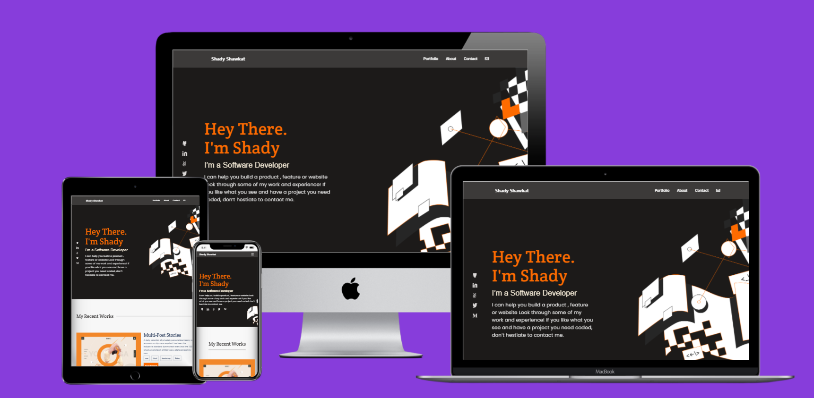

# Portfolio

> This project represents my personal portfolio and will feature my personal info my most recent work and projects.

Additional description about the project and its features.

## Built With

- HTML
- CSS

## Live Demo

[Live Demo Link](https://shadyshawkat.github.io/Portfolio/)

## Getting Started

To get a local copy up and running follow these simple example steps.

1- Navigate to the button on the top right green "code" button.
2- In the drop down menu choose "Download Zip".
3- After extracting the files, you'll have my project on your local machine.

### Prerequisites

### Setup

### Install

### Usage

### Run tests

### Deployment

## Authors

👤 **Shady Shawkat**

- GitHub: [@shadyshawkat](https://github.com/ShadyShawkat)
- Twitter: [@shadyshawkat](https://twitter.com/ShadyShawkat3)
- LinkedIn: [shadyshawkat](https://www.linkedin.com/in/shady-shawkat/)

## Show your support

Give a ⭐️ if you like this project!

## 📝 License

This project is [MIT](./MIT.md) licensed.
